# TP Docker – Évaluation Docker

## Sommaire

1. [Partie 1 — API & Dockerfile](#partie-1--api--dockerfile)
2. [Partie 2 — Registry privé](#partie-2--registry-privé)
3. [Partie 3 — Stack Compose & Nginx](#partie-3--stack-compose--nginx)
4. [Partie 4 — Sécurité](#partie-4--sécurité)
5. [Partie 5 — Validation de la stack](#partie-5--validation-de-la-stack)
6. [Partie 6 — Questions théoriques](#partie-6--questions-théoriques)
7. [Partie 7 — Observabilité & Production](#partie-7--observabilité--production)
8. [Partie 8 — Volumes](#partie-8--volumes)
9. [Partie 9 — CI/CD GitHub Actions](#partie-9--cicd-github-actions)
10. [Partie 10 — Déploiement sur VPS](#partie-10--déploiement-sur-vps)

---

## Partie 1 — API & Dockerfile

### Structure

```
api/
├── app.js
├── package.json
├── Dockerfile
└── .dockerignore
```

### API Express

L'API expose trois routes :

| Route | Description |
|---|---|
| `GET /` | Retourne le hostname du conteneur, la variable `PET` et le compteur de requêtes |
| `GET /healthz` | Retourne `{"status":"ok"}` avec HTTP 200 — utilisé par le Healthcheck Docker |
| `GET /metrics` | Expose les métriques Prometheus via `prom-client` |

Le compteur est géré par `prom-client` (métrique `http_requests_total`) et également retourné dans le corps JSON de `GET /`.

### Dockerfile

- Image de base : `node:20-alpine`
- Dépendances installées avec `npm install --only=production`
- Utilisateur non-root `appuser` créé et utilisé via `USER appuser`
- `.dockerignore` excluant `node_modules`, `.env` et `.git`
- Healthcheck sur `/healthz` : `interval=30s`, `timeout=5s`, `start_period=10s`, `retries=3`

### Tests

Build de l'image :

```bash
docker build -t tp-docker-api:local ./api
```

Lancement :

```bash
docker run -d -e PET=dog -p 3000:3000 tp-docker-api:local
```

**GET /** :

```json
{
  "hostname": "bf8424318c20",
  "pet": "dog",
  "requests": 1
}
```

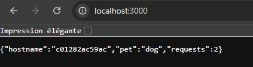

**GET /healthz** :

```json
{"status":"ok"}
```

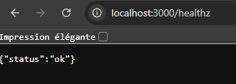

HTTP 200 confirmé. Le conteneur passe en statut `healthy` après le `start_period` de 10 secondes.

**GET /metrics** :

```
http_requests_total 3
```

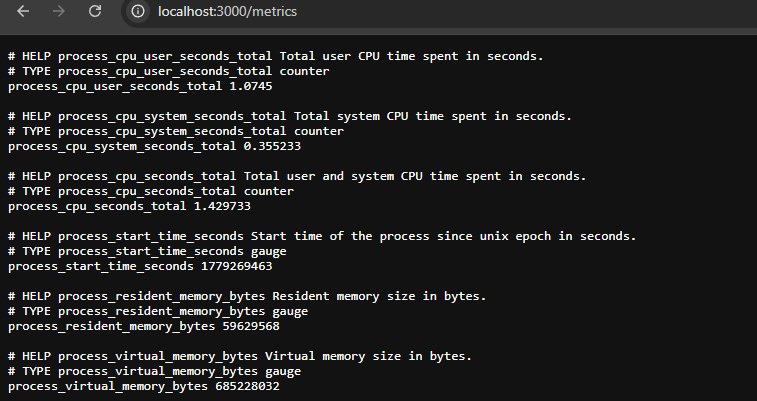

---

## Partie 2 — Registry privé

### Stack registry

Le registry et son interface web sont décrits dans un fichier séparé `docker-compose.registry.yml`, indépendant de la stack principale.

```
docker-compose.registry.yml
├── registry      (registry:2)       → port 5000
└── registry-ui   (joxit/docker-registry-ui)  → port 8081
```

Lancement :

```bash
docker-compose -f docker-compose.registry.yml up -d
```

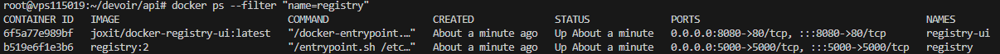

### Push de l'image

```bash
docker build -t tp-docker-api:local ./api
docker tag tp-docker-api:local localhost:5000/mon-api:1.0.0
docker push localhost:5000/mon-api:1.0.0
```

Vérification :

```bash
curl http://localhost:5000/v2/_catalog

curl http://localhost:5000/v2/mon-api/tags/list
```

### Utilisation dans le docker-compose.yml principal

Le `docker-compose.yml` principal utilise l'image depuis le registry privé :

```yaml
services:
  api:
    image: localhost:5000/mon-api:1.0.0
```

#### Rendu :

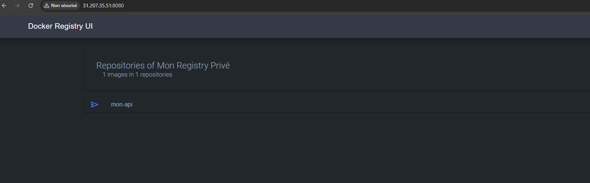

---

## Partie 3 — Stack Compose & Nginx

### Structure

```
docker-compose.yml
nginx/
└── nginx.conf
```

### Services

Trois services sur un réseau Docker personnalisé `app-network` :

| Service | Image | Port exposé hôte | Variable |
|---|---|---|---|
| `cat` | `localhost:5000/mon-api:1.0.0` | aucun | `PET=cat` |
| `dog` | `localhost:5000/mon-api:1.0.0` | aucun | `PET=dog` |
| `nginx` | `nginx:alpine` | 80 | — |

`cat` et `dog` n'exposent aucun port à l'hôte — ils sont uniquement accessibles depuis le réseau interne `app-network`.

### Healthcheck & depends_on

`nginx` démarre uniquement quand `cat` et `dog` sont `healthy` :

```yaml
depends_on:
  cat:
    condition: service_healthy
  dog:
    condition: service_healthy
```

### Configuration Nginx

- `GET /` → upstream round-robin entre `cat:3000` et `dog:3000`

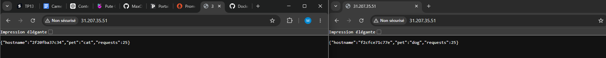

- `GET /cat` → exclusivement vers `cat:3000`

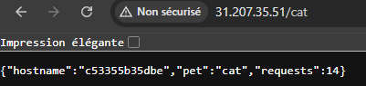

- `GET /dog` → exclusivement vers `dog:3000`

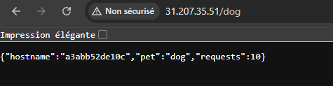

### Tests

```bash
docker-compose up -d

# Round-robin sur /
curl http://31.207.35.51/   # pet: cat
curl http://31.207.35.51/   # pet: dog

# Routes dédiées
curl http://31.207.35.51/cat  # toujours pet: cat
curl http://31.207.35.51/dog  # toujours pet: dog
```

Résultats obtenus :

```json
// GET / — alternance cat/dog confirmée sur 4 appels
{"hostname":"c53355b35dbe","pet":"cat","requests":1}
{"hostname":"c53355b35dbe","pet":"cat","requests":2}
{"hostname":"a3abb52de10c","pet":"dog","requests":1}
{"hostname":"c53355b35dbe","pet":"cat","requests":3}

// GET /cat
{"hostname":"c53355b35dbe","pet":"cat","requests":4}

// GET /dog
{"hostname":"a3abb52de10c","pet":"dog","requests":2}
```

---

## Partie 4 — Sécurité

### Variables d'environnement via `.env`

Toutes les valeurs configurables sont centralisées dans `.env` (exclu du dépôt via `.gitignore`). Un fichier `.env.example` est versionné à la place :

```env
PET_CAT=cat
PET_DOG=dog
NGINX_PORT=80
API_PORT=3000
```

Le `docker-compose.yml` n'contient aucune valeur en dur — tout passe par ces variables :

```yaml
environment:
  - PET=${PET_CAT}
  - PORT=${API_PORT}
ports:
  - "${NGINX_PORT}:80"
```

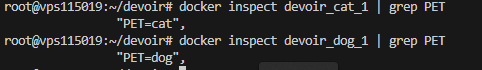

### Dockerfile — ordre des couches

`package*.json` est copié en premier pour exploiter le cache Docker : si le code change mais pas les dépendances, `npm install` n'est pas rejoué.

```dockerfile
COPY package*.json ./
RUN npm install --only=production
COPY . .
```

Le `.dockerignore` exclut `node_modules`, `.env` et `.git` du contexte de build.

### Scan Trivy

```bash
trivy image --severity HIGH,CRITICAL tp-docker-api:local
```

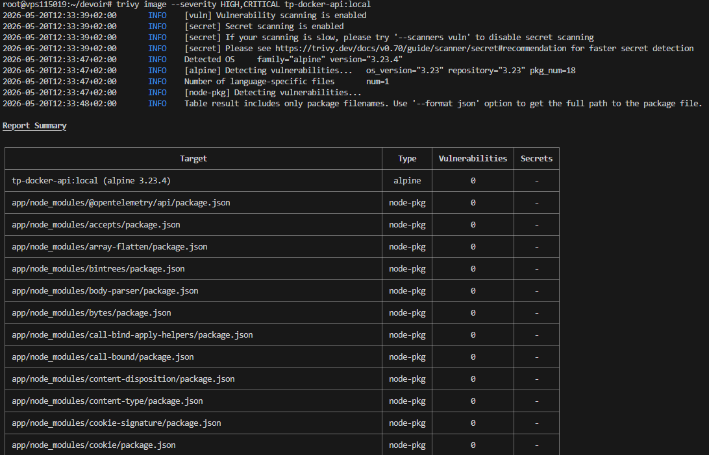

Résultat :

```
Total: 11 (HIGH: 11, CRITICAL: 0)
```

- **OS Alpine 3.23.4 : 0 CVE** — la couche système est propre
- Les 11 HIGH proviennent tous de `cross-spawn` (CVE-2024-21538, ReDoS), dépendance transitive comptée plusieurs fois

**Pourquoi `node:20-alpine` plutôt que `node:latest` ?**

`node:latest` est basé sur Debian Bookworm et embarque des centaines de paquets système (gcc, binutils, libc, openssl…) dont beaucoup ont des CVE connus. `node:20-alpine` repose sur musl libc et BusyBox — surface d'attaque réduite au strict minimum, image 3× plus légère (~180 MB vs ~1 GB), et quasiment zéro CVE OS.

---

## Partie 5 — Validation de la stack

#### Health check

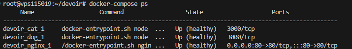

#### Route /


---

## Partie 6 — Questions théoriques

### Question 1 — Swarm : `docker compose up` vs `docker stack deploy`

`docker compose up` lit un fichier `docker-compose.yml` et crée les conteneurs sur **un seul hôte**. C'est un outil de développement local : il gère le cycle de vie des conteneurs (création, réseau, volumes) mais sans haute disponibilité ni orchestration distribuée.

`docker stack deploy` déploie une stack sur un **cluster Swarm** (plusieurs nœuds). Docker répartit les réplicas sur les nœuds disponibles, gère le redémarrage automatique et le rolling update. Il utilise le même format de fichier Compose, mais en mode orchestré.

**Pourquoi `build:` est interdit en Swarm ?**
En mode Swarm, les nœuds workers reçoivent l'ordre de démarrer un service — ils n'ont pas accès au code source local ni au contexte de build. L'image doit déjà exister dans un registry accessible par tous les nœuds. `build:` est une opération locale qui n'a pas de sens dans un contexte distribué : Swarm ne sait pas où se trouve le `Dockerfile`, ni comment construire l'image sur chaque machine.

---

### Question 2 — Secrets : variable d'environnement vs Docker Secret

| | Variable d'environnement | Docker Secret |
|---|---|---|
| Stockage | En clair dans le process env | Chiffré dans le Raft log du Swarm |
| Visibilité | `docker inspect` expose la valeur | Non visible via `docker inspect` |
| Risque | Fuite via logs, sous-process, `/proc` | Monté en RAM (tmpfs), jamais écrit sur disque |

**Où est accessible le secret dans le conteneur ?**

```
/run/secrets/<nom_du_secret>
```

**Lecture depuis Node.js :**

```js
const fs = require('fs');
const password = fs.readFileSync('/run/secrets/db_password', 'utf8').trim();
```

---

### Question 3 — Backup en production

| Élément | Recréable automatiquement ? |
|---|---|
| Images Docker | ✅ Oui — `docker build` depuis le code source |
| Conteneurs en cours | ✅ Oui — recréés par Compose/Swarm |
| Configuration (`docker-compose.yml`, `nginx.conf`, `.env`) | ✅ Oui — si versionnée dans Git |
| **Volumes de données** (bases de données, uploads) | ❌ **Irremplaçable** — à sauvegarder impérativement |
| **Certificats TLS** (si auto-générés hors Let's Encrypt) | ❌ **Irremplaçable** — à sauvegarder |
| **Secrets Docker** (en production sans Swarm) | ❌ À sauvegarder hors cluster |

**Règle essentielle :** tout ce qui est dans un volume nommé (`/var/lib/docker/volumes/`) et qui n'est pas régénérable depuis le code doit être sauvegardé régulièrement (snapshot, `pg_dump`, rsync…). Le code source versionné dans Git et les images dans un registry sont toujours reconstruisables — c'est uniquement la **donnée métier** qui est irremplaçable.

---

## Partie 7 — Observabilité & Production

### Structure

```
monitoring/
├── prometheus/
│   └── prometheus.yml
└── grafana/
    ├── provisioning/
    │   ├── datasources/
    │   │   └── prometheus.yml
    │   └── dashboards/
    │       └── dashboard.yml
    └── dashboards/
        └── api-dashboard.json
docker-compose.prod.yml
```

### Services ajoutés à la stack

| Service | Image | Port | Rôle |
|---|---|---|---|
| `prometheus` | `prom/prometheus` | 40110 | Scrape les métriques |
| `grafana` | `grafana/grafana` | 40111 | Dashboard de visualisation |
| `node-exporter` | `prom/node-exporter` | interne | Métriques système hôte |
| `cadvisor` | `gcr.io/cadvisor/cadvisor` | interne | Métriques conteneurs |
| `portainer` | `portainer/portainer-ce` | 40112 | Interface de gestion Docker |

### Prometheus — targets scrappés

```yaml
scrape_configs:
  - job_name: api-cat       # → cat:3000/metrics
  - job_name: api-dog       # → dog:3000/metrics
  - job_name: node-exporter # → node-exporter:9100
  - job_name: cadvisor      # → cadvisor:8080
```

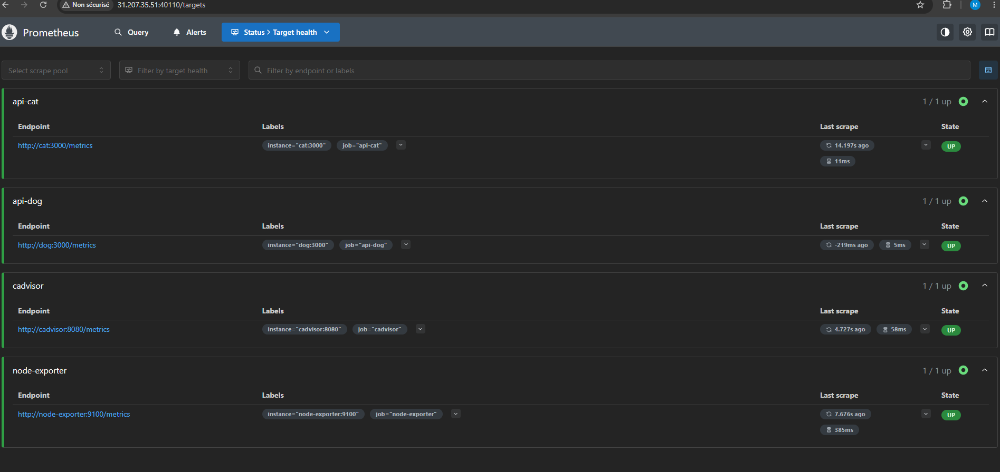

Les 4 targets sont en état `UP` (visible dans Status → Targets).

### Grafana — dashboard provisionné automatiquement

Le dashboard **"API Docker Stack"** est provisionné au démarrage via les fichiers versionnés dans le dépôt — aucune action manuelle requise.

Panels disponibles :
- Requêtes HTTP/sec (rate `http_requests_total`)
- Total requêtes reçues par service
- CPU process Node.js
- Mémoire RSS Node.js (MB)
- Heap Node.js (MB)
- RAM système (Go) via node-exporter

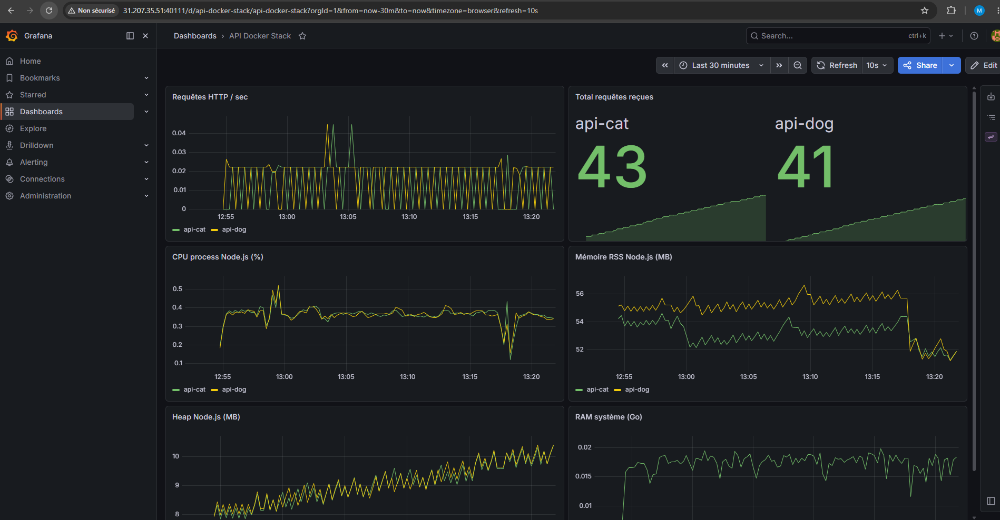

### Portainer

Portainer est accessible sur `http://31.207.35.51:40112`. Il offre une interface web pour gérer les conteneurs, images, volumes et réseaux Docker sans passer par la ligne de commande. Le socket Docker (`/var/run/docker.sock`) est monté en lecture/écriture pour lui donner accès au daemon.

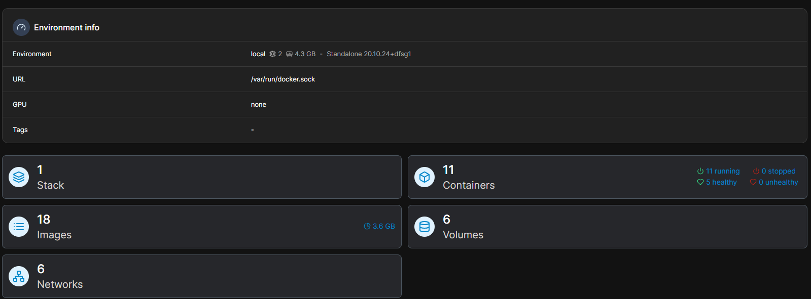

### docker-compose.prod.yml — limites ressources

Le fichier `docker-compose.prod.yml` est un override qui ajoute des limites CPU et RAM sur chaque service via `deploy.resources` :

```bash
# Lancer la stack en mode production
docker-compose -f docker-compose.yml -f docker-compose.prod.yml --compatibility up -d
```

Exemple de limites appliquées :

| Service | CPU max | RAM max |
|---|---|---|
| cat / dog | 0.50 | 128 MB |
| nginx | 0.25 | 64 MB |
| prometheus | 0.50 | 256 MB |
| grafana | 0.50 | 256 MB |

---

## Partie 8 — Volumes

### Volumes nommés (données persistantes)

Les données qui doivent survivre à un redémarrage sont stockées dans des volumes nommés gérés par Docker :

| Volume | Service | Données stockées |
|---|---|---|
| `devoir_grafana-data` | grafana | Base SQLite, sessions, alertes |
| `devoir_prometheus-data` | prometheus | Séries temporelles (TSDB) |
| `devoir_portainer-data` | portainer | Configuration, utilisateurs |
| `devoir_registry-data` | registry | Images Docker poussées |

### Bind mounts (fichiers de configuration)

Les fichiers de configuration sont injectés depuis l'hôte en lecture seule — ils sont versionnés dans le dépôt Git et ne doivent pas être modifiés par les conteneurs :

| Fichier hôte | Cible conteneur | Service |
|---|---|---|
| `./nginx/nginx.conf` | `/etc/nginx/conf.d/default.conf:ro` | nginx |
| `./monitoring/prometheus/prometheus.yml` | `/etc/prometheus/prometheus.yml:ro` | prometheus |
| `./monitoring/grafana/provisioning` | `/etc/grafana/provisioning:ro` | grafana |
| `./monitoring/grafana/dashboards` | `/var/lib/grafana/dashboards:ro` | grafana |

### Justification du choix

- **Volume nommé** pour les données : Docker gère le cycle de vie, les données persistent même si le conteneur est supprimé et recréé. Indispensable pour Grafana (dashboards créés manuellement, sessions) et Prometheus (historique des métriques).
- **Bind mount en `:ro`** pour les configs : la configuration est la source de vérité dans Git. Le `:ro` empêche le conteneur de modifier accidentellement les fichiers.

### Vérification

```bash
docker volume ls
```

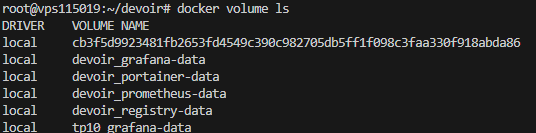

```bash
docker volume inspect devoir_grafana-data
```

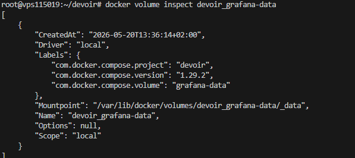

---

## Partie 9 — CI/CD GitHub Actions

### Fichier `.github/workflows/docker.yml`

Le workflow se déclenche à chaque push sur `main` et enchaîne trois étapes :

1. **Build** — construit l'image depuis `./api`
2. **Scan Trivy** — échoue si des CVE de sévérité `CRITICAL` sont détectées
3. **Push** — pousse l'image vers `ghcr.io` avec un tag basé sur le SHA court du commit

### Tag de l'image

```
ghcr.io/maxouvrard/mon-api:git-<sha7>
```

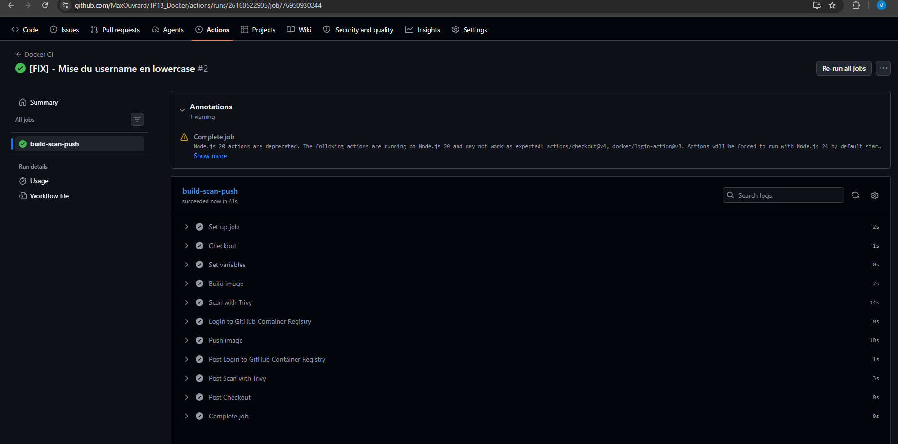

Exemple : `ghcr.io/maxouvrard/mon-api:git-abc1234`

### Registry

Utilisation de **GitHub Container Registry (ghcr.io)** — aucun secret supplémentaire requis, le `GITHUB_TOKEN` est fourni automatiquement par GitHub Actions.

### Comportement du scan Trivy

| Sévérité | Comportement |
|---|---|
| CRITICAL | Pipeline en échec (`exit-code: 1`) |
| HIGH / MEDIUM / LOW | Pipeline continue |

Notre image `node:20-alpine` ne contient **0 CVE CRITICAL** — le pipeline passe systématiquement.

### Workflow complet

```yaml
on:
  push:
    branches: [main]

jobs:
  build-scan-push:
    steps:
      - Checkout
      - Build image → ghcr.io/maxouvrard/mon-api:git-<sha>
      - Scan Trivy (CRITICAL → exit 1)
      - Login ghcr.io (GITHUB_TOKEN)
      - Push image
```

---

## Partie 10 — Déploiement sur VPS

### IP publique

**`31.207.35.51`**

### Services accessibles

| Service | URL |
|---|---|
| API (via Nginx) | `http://31.207.35.51/` |
| API cat | `http://31.207.35.51/cat` |
| API dog | `http://31.207.35.51/dog` |
| Prometheus | `http://31.207.35.51:40110` |
| Grafana | `http://31.207.35.51:40111` — login : `admin` / `admin` |
| Portainer | `http://31.207.35.51:40112` |
| Registry UI | `http://31.207.35.51:8081` |

### État de la stack sur le VPS

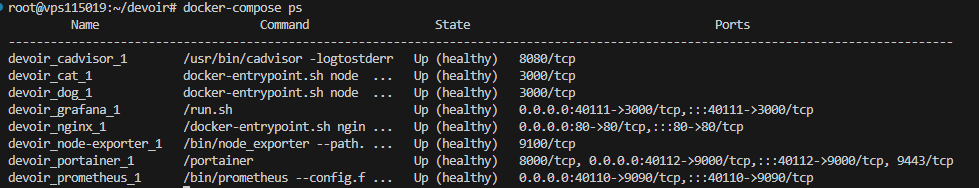